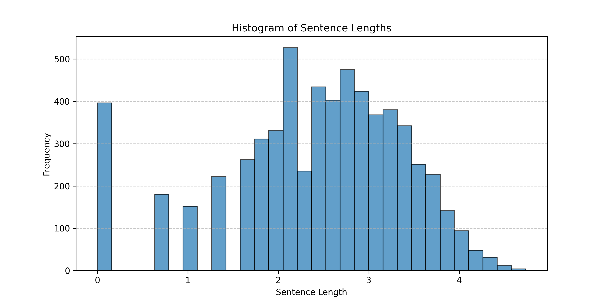
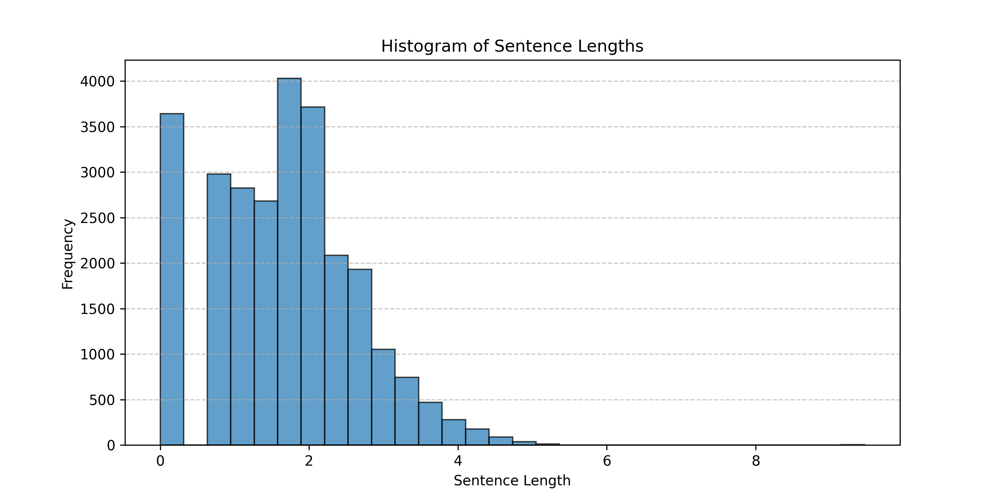

# Next Word Prediction

This repository contains a language modeling project using Feedforward Neural Networks (FFNN), Recurrent Neural Networks (RNN), and Long Short-Term Memory (LSTM) models for text prediction. The models are trained on classic literature corpora and can predict the next word in a given sequence.

### Features

- **Corpus Cleaning**: Preprocessing text from "Pride and Prejudice" and "Ulysses."
- **Tokenization**: Converts text into structured tokens for model training.
- **Dataset Preparation**: Supports both sequence-based and N-gram-based training.
- **Multiple Language Models**: Implements FFNN, RNN, and LSTM for comparison.
- **Next-Word Prediction**: Predicts the most probable next words based on input.

---

## Installation

1. Clone the repository:

   ```bash
   https://github.com/gojira69/Next-Word-Prediction.git
   cd your-repo
   ```

2. Install dependencies:
   ```bash
   pip install torch numpy
   ```

---

## Usage

Run the script interactively:

```bash
python generator_clean.py
```

Follow the prompts:

- Enter the path to the text corpus.
- Choose the language model type (`f` for FFNN, `r` for RNN, `l` for LSTM).
- Provide the number of next-word candidates.
- Input a sentence to get predictions.

---

## Model Details

### Feedforward Neural Network (FFNN)

- Uses word embeddings and dense layers.
- Predicts the next word based on N previous words. (N = 3, 5)
- Implemented in `FFNN` class.

### Recurrent Neural Network (RNN)

- Uses recurrent layers to capture sequential patterns.
- Trained using entire tokenized sentences.
- Implemented in `RNN` class.

### Long Short-Term Memory (LSTM)

- Improves RNN by handling long-range dependencies.
- More effective for structured text.
- Implemented in `LSTM` class.

Upon analysis on the corpus themselves, the sentence lengths were very different. The _Ulysses_ corpus had much frequent and longer sentences of the order of 10<sup>3</sup> and 10<sup>4</sup> when compared to the _Pride and Prejudice_ corpus.




Thus, for computational purposes, sentences which had tokens less than 100 were considered for RNNs and LSTMs.

---

## File Structure

```
.
├── generator_clean.py   # Main script for training and prediction
├── pretrained_models/   # Directory to store pre-trained models
└── README.md            # Documentation
```

pretrained models are available [here](https://drive.google.com/drive/folders/15kmj1GT8hqqvSpKLlAwI7jN9KCZT30tJ?usp=sharing).

---

## Example Prediction

```
Input: "It is a truth universally"
Output:
1. acknowledged (0.75)
2. known (0.12)
3. accepted (0.05)
```

---

## Hyperparameter Tuning

For hyperparameter tuning, it is advisable to use the python notebooks of the 3 different neural architectures to try different hyperparameters. _Logging_, _Model Saving_, etc, are all implemented.

## Future Work

- Support for more complex architectures like Transformer-based models.
- Addition of more diverse text corpora.
- Optimization for larger datasets.

---
